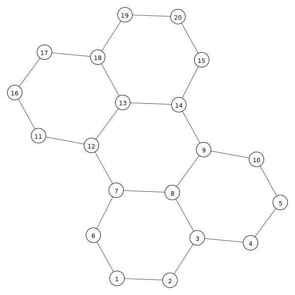

# Honeycomb cRPD Mesh

Deploy Juniper cRPD containers at scale and meshed by three links each to build a topology that resembles honeycomb/hexagons. 
Docker-compose is used to scale up the number of nodes that are automatically interconnected via veth pairs by add_link.py deployed
within the link container. The same script also auto-generates a grid topology bitmap, which can be exctracted from the container 
at runtime (check the validate.sh script). 



Each node is running cRPD with an auto-generated IPv6 loopback and link-local addresse with Level-2 ISIS and per-packet load balancing to gain
full connectivity across the topology. The size of the topology can be adjusted by changed the scale parameter plus setting the desired # of
rows and columns as arguments to the link container in the docker-compose file.

## Requirements

- Linux based baremetal server with enough memory (150MB per cRPD instances, e.g. 400 nodes fit within 64GB of RAM)
- Docker with docker-compose 
- Juniper cRPD 20.3R1 or newer container image (https://www.juniper.net/us/en/dm/crpd-trial/)
- tested so far on Ubuntu 20.04, Fedora 33 and on Docker-for-Mac

## 20-node deployment

Simply run make to build and deploy 20 nodes, arranged in 4 rows by 5 columns:

```
$ make
docker-compose --project-name honeycomb build
Step 1/6 : FROM crpd:20.3R1.8
 ---> b52c3fc6235a
Step 2/6 : RUN apt-get update   && apt-get -y --no-install-recommends install bwm-ng gettext-base   && rm -rf /var/lib/apt/lists/*
 ---> Running in 187b306d8f43
. . . 
Successfully built 8c31ccd83b72
Successfully tagged honeycomb_links:latest
docker-compose -f docker-compose-400.yml --project-name honeycomb down --remove-orphans
docker-compose --project-name honeycomb up -d
./validate.sh

waiting for ISIS adjacencies to come up 3
waiting for 20 routes learned ...

34 routes learned
Completed 24 links for 20 (4x5) nodes in 4 seconds
validation completed in 9 seconds

network diagram saved in
-rw-r--r-- 1 mwiget mwiget 15418 Nov 15 16:29 honeycomb.png
./test-nodes.sh

20 nodes found

show route summary on node 3:
Autonomous system number: 4259905011
Router ID: 10.0.0.11

RIB Unique destination routes high watermark: 30 at 2020-11-15 15:29:47
RIB routes high watermark: 30 at 2020-11-15 15:29:47
FIB routes high watermark: 20 at 2020-11-15 15:29:47
VRF type routing instances high watermark: 0 at 2020-11-15 15:29:40

iso.0: 1 destinations, 1 routes (1 active, 0 holddown, 0 hidden)
              Direct:      1 routes,      1 active

inet6.0: 29 destinations, 29 routes (29 active, 0 holddown, 0 hidden)
              Direct:      3 routes,      3 active
               Local:      6 routes,      6 active
               IS-IS:     19 routes,     19 active
               INET6:      1 routes,      1 active
show first few routes on crpd node 3:

iso.0: 1 destinations, 1 routes (1 active, 0 holddown, 0 hidden)
+ = Active Route, - = Last Active, * = Both

47.0005.abcd.abcd.0000.0000.0010.7c55.c543.ebc4/152               
                   *[Direct/0] 00:00:08
                    >  via lo.0

inet6.0: 29 destinations, 29 routes (29 active, 0 holddown, 0 hidden)
+ = Active Route, - = Last Active, * = Both

::/96              *[Direct/0] 00:00:08
                    >  via sit0
::127.0.0.1/128    *[Local/0] 00:00:08
                       Local via sit0
fd00::1/128        *[IS-IS/18] 00:00:07, metric 20
                    >  to fe80::2894:b6ff:fe5d:beb3 via eth0
fd00::2/128        *[IS-IS/18] 00:00:07, metric 10
                    >  to fe80::2894:b6ff:fe5d:beb3 via eth0
fd00::3/128        *[Direct/0] 00:00:08
                    >  via lo.0
fd00::4/128        *[IS-IS/18] 00:00:07, metric 10
                    >  to fe80::8f2:3aff:fe91:aa4f via eth1
fd00::5/128        *[IS-IS/18] 00:00:07, metric 20
                    >  to fe80::8f2:3aff:fe91:aa4f via eth1
fd00::6/128        *[IS-IS/18] 00:00:02, metric 30
                       to fe80::2894:b6ff:fe5d:beb3 via eth0
                    >  to fe80::2c9d:94ff:feaa:ed36 via eth2
fd00::7/128        *[IS-IS/18] 00:00:02, metric 20
                    >  to fe80::2c9d:94ff:feaa:ed36 via eth2
fd00::8/128        *[IS-IS/18] 00:00:02, metric 10
                    >  to fe80::2c9d:94ff:feaa:ed36 via eth2
fd00::9/128        *[IS-IS/18] 00:00:02, metric 20
                    >  to fe80::2c9d:94ff:feaa:ed36 via eth2
fd00::10/128       *[IS-IS/18] 00:00:02, metric 30
                       to fe80::8f2:3aff:fe91:aa4f via eth1
                    >  to fe80::2c9d:94ff:feaa:ed36 via eth2
fd00::11/128       *[IS-IS/18] 00:00:01, metric 40
                    >  to fe80::2c9d:94ff:feaa:ed36 via eth2
fd00::12/128       *[IS-IS/18] 00:00:02, metric 30

show first few routes on node 3:
::/96 dev sit0 proto kernel metric 256 pref medium
fd00::1 via fe80::2894:b6ff:fe5d:beb3 dev eth0 proto 22 metric 1024 pref medium
fd00::2 via fe80::2894:b6ff:fe5d:beb3 dev eth0 proto 22 metric 1024 pref medium
fd00::3 dev lo proto kernel metric 256 pref medium
fd00::4 via fe80::8f2:3aff:fe91:aa4f dev eth1 proto 22 metric 1024 pref medium
fd00::5 via fe80::8f2:3aff:fe91:aa4f dev eth1 proto 22 metric 1024 pref medium
fd00::6 proto 22 metric 1024 
	nexthop via fe80::2894:b6ff:fe5d:beb3 dev eth0 weight 1 
	nexthop via fe80::2c9d:94ff:feaa:ed36 dev eth2 weight 1 
fd00::7 via fe80::2c9d:94ff:feaa:ed36 dev eth2 proto 22 metric 1024 pref medium
fd00::8 via fe80::2c9d:94ff:feaa:ed36 dev eth2 proto 22 metric 1024 pref medium
fd00::9 via fe80::2c9d:94ff:feaa:ed36 dev eth2 proto 22 metric 1024 pref medium
fd00::10 proto 22 metric 1024 
	nexthop via fe80::8f2:3aff:fe91:aa4f dev eth1 weight 1 
	nexthop via fe80::2c9d:94ff:feaa:ed36 dev eth2 weight 1 
fd00::11 via fe80::2c9d:94ff:feaa:ed36 dev eth2 proto 22 metric 1024 pref medium
fd00::12 via fe80::2c9d:94ff:feaa:ed36 dev eth2 proto 22 metric 1024 pref medium
fd00::13 via fe80::2c9d:94ff:feaa:ed36 dev eth2 proto 22 metric 1024 pref medium
fd00::14 via fe80::2c9d:94ff:feaa:ed36 dev eth2 proto 22 metric 1024 pref medium
fd00::15 via fe80::2c9d:94ff:feaa:ed36 dev eth2 proto 22 metric 1024 pref medium

show isis routes on node 1:
 IS-IS routing table             Current version: L1: 1 L2: 6
IPv4/IPv6 Routes
----------------
Prefix             L Version   Metric Type Interface       NH   Via                 Backup Score
fd00::2/128        2       6       10 int  eth0            IPV6 b1c70fadb6d4       
fd00::3/128        2       6       20 int  eth0            IPV6 b1c70fadb6d4       
fd00::4/128        2       6       30 int  eth0            IPV6 b1c70fadb6d4       
fd00::5/128        2       6       40 int  eth0            IPV6 b1c70fadb6d4       
fd00::6/128        2       6       10 int  eth1            IPV6 6ee2dea5f6a7       
fd00::7/128        2       6       20 int  eth1            IPV6 6ee2dea5f6a7       
fd00::8/128        2       6       30 int  eth1            IPV6 6ee2dea5f6a7       
                                           eth0            IPV6 b1c70fadb6d4       
fd00::9/128        2       6       40 int  eth1            IPV6 6ee2dea5f6a7       
                                           eth0            IPV6 b1c70fadb6d4       
fd00::10/128       2       6       50 int  eth0            IPV6 b1c70fadb6d4       
                                           eth1            IPV6 6ee2dea5f6a7       
fd00::11/128       2       6       40 int  eth1            IPV6 6ee2dea5f6a7       
fd00::12/128       2       6       30 int  eth1            IPV6 6ee2dea5f6a7       
fd00::13/128       2       6       40 int  eth1            IPV6 6ee2dea5f6a7       
fd00::14/128       2       6       50 int  eth1            IPV6 6ee2dea5f6a7       
                                           eth0            IPV6 b1c70fadb6d4       
fd00::15/128       2       6       60 int  eth1            IPV6 6ee2dea5f6a7       
                                           eth0            IPV6 b1c70fadb6d4       
fd00::16/128       2       6       50 int  eth1            IPV6 6ee2dea5f6a7       
fd00::17/128       2       6       60 int  eth1            IPV6 6ee2dea5f6a7       
fd00::18/128       2       6       50 int  eth1            IPV6 6ee2dea5f6a7       
fd00::19/128       2       6       80 int  eth1            IPV6 6ee2dea5f6a7       
                                           eth0            IPV6 b1c70fadb6d4       
fd00::20/128       2       6       70 int  eth1            IPV6 6ee2dea5f6a7       
                                           eth0            IPV6 b1c70fadb6d4       

node_20 loopback ipv6 is fd00::20

show route to node_20 from node1:
fd00::20 from :: via fe80::b43e:c9ff:fe8c:45dd dev eth0 proto 22 src fd00::1 metric 1024 pref medium

show isis spf log on node_1
 IS-IS level 1 SPF log:
Start time          Elapsed (secs) Count Reason
Sun Nov 15 15:29:40        0.000051    3 Reconfig

 IS-IS level 2 SPF log:
Start time          Elapsed (secs) Count Reason
Sun Nov 15 15:29:40        0.000075   26 Reconfig
Sun Nov 15 15:29:41        0.000113    4 Updated LSP 33a03f9b8221.00-00
Sun Nov 15 15:29:41        0.000086    2 New LSP f535b3da6e04.00-00
Sun Nov 15 15:29:46        0.000132   25 Updated LSP f535b3da6e04.00-00
Sun Nov 15 15:29:47        0.000142    2 New LSP bc8ea96e1816.00-00
Sun Nov 15 15:29:47        0.000146    2 Updated LSP 7e84a126afeb.00-00

traceroute to node_20 from node1 with 16 simultaneous probes:
traceroute to fd00::20 (fd00::20), 30 hops max, 80 byte packets
 1  fd00::2  0.063 ms  0.008 ms  0.007 ms  0.007 ms  0.006 ms  0.006 ms
 2  fd00::3  0.037 ms  0.011 ms  0.011 ms  0.010 ms  0.011 ms  0.010 ms
 3  * * * * * *
 4  * * * * * *
 5  * * * * fd00::14  0.201 ms  0.048 ms
 6  fd00::15  0.059 ms  0.027 ms  0.024 ms  0.025 ms  0.025 ms  0.023 ms
 7  fd00::20  0.051 ms  0.029 ms  0.078 ms  0.029 ms  0.027 ms  0.027 ms
```

The generated image uses a grid, which scales best with large topologies:


Memory usage:

```
$ docker stats --no-stream
CONTAINER ID        NAME                CPU %               MEM USAGE / LIMIT     MEM %               NET I/O             BLOCK I/O           PIDS
aeb8c5e574e7        honeycomb_node_6    0.56%               126MiB / 62.54GiB     0.20%               0B / 0B             8.19kB / 8.26MB     45
cd24fa60f05b        honeycomb_node_4    0.47%               126.7MiB / 62.54GiB   0.20%               0B / 0B             123kB / 4.31MB      45
1f5de4d85977        honeycomb_node_15   0.46%               126MiB / 62.54GiB     0.20%               0B / 0B             131kB / 6.84MB      44
1721cfa01f1c        honeycomb_node_20   0.57%               126.8MiB / 62.54GiB   0.20%               0B / 0B             1.34MB / 1.63MB     45
f92603170529        honeycomb_node_1    0.61%               126.5MiB / 62.54GiB   0.20%               0B / 0B             459kB / 5.33MB      45
a87953d7b45f        honeycomb_node_12   0.61%               126.4MiB / 62.54GiB   0.20%               0B / 0B             496kB / 1.54MB      45
d301a1ba8e29        honeycomb_node_3    0.48%               126.9MiB / 62.54GiB   0.20%               0B / 0B             602kB / 2.9MB       45
c46b0d0f0f12        honeycomb_node_18   0.55%               126.7MiB / 62.54GiB   0.20%               0B / 0B             0B / 6.12MB         45
89f7a4e23e16        honeycomb_node_9    0.60%               126.3MiB / 62.54GiB   0.20%               0B / 0B             242kB / 3.67MB      44
d27c21c053b0        honeycomb_node_17   0.55%               126MiB / 62.54GiB     0.20%               0B / 0B             4.1kB / 5.98MB      45
ffa8fdac22b1        honeycomb_node_14   0.55%               126.3MiB / 62.54GiB   0.20%               0B / 0B             69.6kB / 5.82MB     45
6a39bec65c8c        honeycomb_node_8    0.57%               125.8MiB / 62.54GiB   0.20%               0B / 0B             897kB / 2.52MB      45
136876c24d9e        honeycomb_node_11   0.50%               125.8MiB / 62.54GiB   0.20%               0B / 0B             8.19kB / 4.04MB     45
3ca6d0148dd9        honeycomb_node_2    0.54%               126.4MiB / 62.54GiB   0.20%               0B / 0B             147kB / 5.76MB      45
f660461a64bc        honeycomb_node_5    0.60%               126.4MiB / 62.54GiB   0.20%               0B / 0B             1.06MB / 4.31MB     45
631d6dfff87d        honeycomb_node_19   0.58%               126.2MiB / 62.54GiB   0.20%               0B / 0B             0B / 1.88MB         45
a46935abf5d0        honeycomb_node_10   0.57%               126.2MiB / 62.54GiB   0.20%               0B / 0B             111kB / 3.3MB       45
0ddc503267be        honeycomb_node_16   0.43%               127.1MiB / 62.54GiB   0.20%               0B / 0B             51.4MB / 2.79MB     45
c5b7a7738fb0        honeycomb_node_13   0.49%               127.1MiB / 62.54GiB   0.20%               0B / 0B             18.4MB / 2.99MB     45
2835a2d258a0        honeycomb_node_7    0.52%               127.6MiB / 62.54GiB   0.20%               0B / 0B             46.5MB / 2.54MB     45
b314a3341e39        honeycomb_links_1   0.00%               35.86MiB / 62.54GiB   0.06%               0B / 0B             184kB / 0B          1
```

## 400-node deployment

This rather large topology requires at least 64GB of RAM and still takes less than 3 minutes to deploy on a recent server:

```
$ make scale400
. . . 
docker-compose -f docker-compose-400.yml --project-name honeycomb down --remove-orphans                                                                                  
docker-compose -f docker-compose-400.yml --project-name honeycomb up -d                                                                                                  
./validate.sh                                                                                                                                                            
                                                                                                                                                                         
waiting for ISIS adjacencies to come up ..............3                                                                                                                  
waiting for 400 routes learned ...                                                                                                                                       
                                                                                                                                                                         
742 routes learned                                                                                                                                                       
Completed 570 links for 400 (20x20) nodes in 120 seconds                                                                                                                 
validation completed in 106 seconds                                                                                                                                      
```


Complete log output can be found in [make-scale400-log.txt](make-scale400-log.txt).

## Docker for OSX

20-node deployment works just fine, though it takes a bit over a minute to bootstrap. Simply launch it via

```
$ make
. . .
Creating honeycomb_node_18 ... done                                                                                                                                      
Creating honeycomb_node_19 ... done                                                                                                                                      
Creating honeycomb_node_20 ... done                                                                                                                                      
./validate.sh
                                                                                                                                                                         waiting for ISIS adjacencies to come up ....       3
waiting for       20 routes learned

21 routes learned

Completed 24 links for 20 (4x5) nodes in 45 seconds
validation completed in 89 seconds
```

To verify the linuxkit version the container run on:

```
$ docker exec -ti honeycomb_node_20 uname -a
Linux c9fabea03fa3 5.4.39-linuxkit #1 SMP Fri May 8 23:03:06 UTC 2020 x86_64 x86_64 x86_64 GNU/Linux
```

