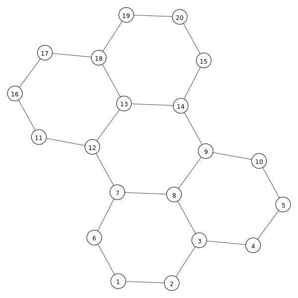

# Honeycomb cRPD Mesh

Deploy Juniper cRPD containers at scale and meshed by three links each to build a topology that resembles honeycomb/hexagons. 
Docker-compose is used to scale up the number of nodes that are automatically interconnected via veth pairs by add_link.py deployed
within the link container. The same script also auto-generates a grid topology bitmap, which can be exctracted from the container 
at runtime (check the validate.sh script). 



Each node is running cRPD with an auto-generated IPv6 loopback and link-local addresse with Level-2 ISIS and per-packet load balancing to gain
full connectivity across the topology. The size of the topology can be adjusted by changed the scale parameter plus setting the desired # of
rows and columns as arguments to the link container in the docker-compose file.

## Requirements

- Linux based baremetal server with enough memory (150MB per cRPD instances, e.g. 400 nodes fit within 64GB of RAM), tested with Ubuntu 20.04
- Docker with docker-compose 
- Juniper cRPD 20.3R1 or newer container image (http://https://www.juniper.net/us/en/dm/crpd-trial/)

## 20-node deployment

Simply run make to build and deploy 20 nodes, arranged in 4 rows by 5 columns:

```
$ make
docker-compose --project-name honeycomb build
Step 1/6 : FROM crpd:20.3R1.8
 ---> b52c3fc6235a
Step 2/6 : RUN apt-get update   && apt-get -y --no-install-recommends install bwm-ng gettext-base   && rm -rf /var/lib/apt/lists/*
 ---> Running in 187b306d8f43
. . . 
Successfully built 8c31ccd83b72
Successfully tagged honeycomb_links:latest
docker-compose -f docker-compose-400.yml --project-name honeycomb down --remove-orphans
docker-compose --project-name honeycomb up -d
./validate.sh

waiting for ISIS adjacencies to come up 3
waiting for 20 routes learned ..

25 routes learned
Completed 24 links for 20 (4x5) nodes in 5 seconds
validation completed in 8 seconds

network diagram saved in
-rw-r--r-- 1 mwiget mwiget 15418 Nov 14 14:38 honeycomb.png
./test-nodes.sh

20 nodes found

show route summary on node 3:
Autonomous system number: 4259905011
Router ID: 10.0.0.11

RIB Unique destination routes high watermark: 25 at 2020-11-14 13:38:27
RIB routes high watermark: 25 at 2020-11-14 13:38:27
FIB routes high watermark: 15 at 2020-11-14 13:38:27
VRF type routing instances high watermark: 0 at 2020-11-14 13:38:21

iso.0: 1 destinations, 1 routes (1 active, 0 holddown, 0 hidden)
              Direct:      1 routes,      1 active

inet6.0: 24 destinations, 24 routes (24 active, 0 holddown, 0 hidden)
              Direct:      3 routes,      3 active
               Local:      6 routes,      6 active
               IS-IS:     14 routes,     14 active
               INET6:      1 routes,      1 active
show first few routes on crpd node 3:

iso.0: 1 destinations, 1 routes (1 active, 0 holddown, 0 hidden)
+ = Active Route, - = Last Active, * = Both

47.0005.abcd.abcd.0000.0000.0010.d301.a1ba.8e29/152               
                   *[Direct/0] 00:00:06
                    >  via lo.0

inet6.0: 24 destinations, 24 routes (24 active, 0 holddown, 0 hidden)
+ = Active Route, - = Last Active, * = Both

::/96              *[Direct/0] 00:00:06
                    >  via sit0
::127.0.0.1/128    *[Local/0] 00:00:06
                       Local via sit0
fd00::ddc:5032:67be/128
                   *[IS-IS/18] 00:00:00, metric 50
                    >  to fe80::c00b:e9ff:fe63:3aa9 via eth2
fd00::1368:76c2:4d9e/128
                   *[IS-IS/18] 00:00:00, metric 40
                    >  to fe80::c00b:e9ff:fe63:3aa9 via eth2
fd00::2835:a2d2:58a0/128
                   *[IS-IS/18] 00:00:00, metric 20
                    >  to fe80::c00b:e9ff:fe63:3aa9 via eth2
fd00::3ca6:d014:8dd9/128
                   *[IS-IS/18] 00:00:06, metric 10
                    >  to fe80::c37:dbff:fe31:43db via eth0
fd00::6a39:bec6:5c8c/128
                   *[IS-IS/18] 00:00:00, metric 10
                    >  to fe80::c00b:e9ff:fe63:3aa9 via eth2
fd00::89f7:a4e2:3e16/128
                   *[IS-IS/18] 00:00:00, metric 20
                    >  to fe80::c00b:e9ff:fe63:3aa9 via eth2
fd00::a469:35ab:f5d0/128
                   *[IS-IS/18] 00:00:00, metric 30
                       to fe80::40ad:f7ff:fecc:bb1c via eth1
                    >  to fe80::c00b:e9ff:fe63:3aa9 via eth2
fd00::a879:53d7:b45f/128
                   *[IS-IS/18] 00:00:00, metric 30
                    >  to fe80::c00b:e9ff:fe63:3aa9 via eth2

show first few routes on node 3:
::/96 dev sit0 proto kernel metric 256 pref medium
fd00::ddc:5032:67be via fe80::c00b:e9ff:fe63:3aa9 dev eth2 proto 22 metric 1024 pref medium
fd00::1368:76c2:4d9e via fe80::c00b:e9ff:fe63:3aa9 dev eth2 proto 22 metric 1024 pref medium
fd00::2835:a2d2:58a0 via fe80::c00b:e9ff:fe63:3aa9 dev eth2 proto 22 metric 1024 pref medium
fd00::3ca6:d014:8dd9 via fe80::c37:dbff:fe31:43db dev eth0 proto 22 metric 1024 pref medium
fd00::6a39:bec6:5c8c via fe80::c00b:e9ff:fe63:3aa9 dev eth2 proto 22 metric 1024 pref medium
fd00::89f7:a4e2:3e16 via fe80::c00b:e9ff:fe63:3aa9 dev eth2 proto 22 metric 1024 pref medium
fd00::a469:35ab:f5d0 proto 22 metric 1024 
	nexthop via fe80::40ad:f7ff:fecc:bb1c dev eth1 weight 1 
	nexthop via fe80::c00b:e9ff:fe63:3aa9 dev eth2 weight 1 
fd00::a879:53d7:b45f via fe80::c00b:e9ff:fe63:3aa9 dev eth2 proto 22 metric 1024 pref medium
fd00::c46b:d0f:f12 via fe80::c00b:e9ff:fe63:3aa9 dev eth2 proto 22 metric 1024 pref medium
fd00::c5b7:a773:8fb0 via fe80::c00b:e9ff:fe63:3aa9 dev eth2 proto 22 metric 1024 pref medium
fd00::cd24:fa60:f05b via fe80::40ad:f7ff:fecc:bb1c dev eth1 proto 22 metric 1024 pref medium
fd00::d27c:21c0:53b0 via fe80::c00b:e9ff:fe63:3aa9 dev eth2 proto 22 metric 1024 pref medium
fd00::d301:a1ba:8e29 dev lo proto kernel metric 256 pref medium
fd00::f660:461a:64bc via fe80::40ad:f7ff:fecc:bb1c dev eth1 proto 22 metric 1024 pref medium
fd00::ffa8:fdac:22b1 via fe80::c00b:e9ff:fe63:3aa9 dev eth2 proto 22 metric 1024 pref medium
fe80::/64 dev eth0 proto kernel metric 256 pref medium
fe80::/64 dev eth1 proto kernel metric 256 pref medium

show isis routes on node 1:
 IS-IS routing table             Current version: L1: 1 L2: 5
IPv4/IPv6 Routes
----------------
Prefix             L Version   Metric Type Interface       NH   Via                 Backup Score
fd00::ddc:5032:67be/128 2       5       50 int eth1        IPV6 aeb8c5e574e7       
fd00::1368:76c2:4d9e/128 2       5       40 int eth1       IPV6 aeb8c5e574e7       
fd00::2835:a2d2:58a0/128 2       5       20 int eth1       IPV6 aeb8c5e574e7       
fd00::3ca6:d014:8dd9/128 2       5       10 int eth0       IPV6 3ca6d0148dd9       
fd00::6a39:bec6:5c8c/128 2       5       30 int eth1       IPV6 aeb8c5e574e7       
                                           eth0            IPV6 3ca6d0148dd9       
fd00::89f7:a4e2:3e16/128 2       5       40 int eth1       IPV6 aeb8c5e574e7       
                                           eth0            IPV6 3ca6d0148dd9       
fd00::a469:35ab:f5d0/128 2       5       50 int eth1       IPV6 aeb8c5e574e7       
                                           eth0            IPV6 3ca6d0148dd9       
fd00::a879:53d7:b45f/128 2       5       30 int eth1       IPV6 aeb8c5e574e7       
fd00::aeb8:c5e5:74e7/128 2       5       10 int eth1       IPV6 aeb8c5e574e7       
fd00::c46b:d0f:f12/128 2       5       50 int eth1         IPV6 aeb8c5e574e7       
fd00::c5b7:a773:8fb0/128 2       5       40 int eth1       IPV6 aeb8c5e574e7       
fd00::cd24:fa60:f05b/128 2       5       30 int eth0       IPV6 3ca6d0148dd9       
fd00::d27c:21c0:53b0/128 2       5       60 int eth1       IPV6 aeb8c5e574e7       
fd00::d301:a1ba:8e29/128 2       5       20 int eth0       IPV6 3ca6d0148dd9       
fd00::f660:461a:64bc/128 2       5       40 int eth0       IPV6 3ca6d0148dd9       
fd00::ffa8:fdac:22b1/128 2       5       50 int eth1       IPV6 aeb8c5e574e7       
                                           eth0            IPV6 3ca6d0148dd9       

node_20 loopback ipv6 is fd00::1721:cfa0:1f1c

show route to node_20 from node1:
fd00::1721:cfa0:1f1c from :: via fe80::3c05:96ff:fe0e:4de dev eth0 proto 22 src fd00::f926:317:529 metric 1024 pref medium

traceroute to node_20 from node1 with 16 simultaneous probes:
traceroute to fd00::1721:cfa0:1f1c (fd00::1721:cfa0:1f1c), 30 hops max, 80 byte packets
 1  fd00::aeb8:c5e5:74e7  0.061 ms  0.007 ms  0.005 ms  0.005 ms  0.004 ms  0.005 ms
 2  fd00::2835:a2d2:58a0  0.037 ms !N  0.008 ms !N  0.007 ms !N  0.008 ms !N  0.007 ms !N  0.007 ms !N

show isis spf log on node_1
 IS-IS level 1 SPF log:
Start time          Elapsed (secs) Count Reason
Sat Nov 14 13:38:21        0.000045    2 Reconfig

 IS-IS level 2 SPF log:
Start time          Elapsed (secs) Count Reason
Sat Nov 14 13:38:21        0.000097   22 Reconfig
Sat Nov 14 13:38:22        0.000313    6 Updated LSP a46935abf5d0.00-00
Sat Nov 14 13:38:22        0.000339    1 New LSP a87953d7b45f.00-00
Sat Nov 14 13:38:27        0.000142   21 New LSP c5b7a7738fb0.00-00
Sat Nov 14 13:38:28        0.000090    1 Updated LSP c5b7a7738fb0.00-00
Sat Nov 14 13:38:28        0.000145    1 Updated LSP ffa8fdac22b1.00-00
```

The generated image uses a grid, which scales best with large topologies:


Memory usage:

```
$ docker stats --no-stream
CONTAINER ID        NAME                CPU %               MEM USAGE / LIMIT     MEM %               NET I/O             BLOCK I/O           PIDS
aeb8c5e574e7        honeycomb_node_6    0.56%               126MiB / 62.54GiB     0.20%               0B / 0B             8.19kB / 8.26MB     45
cd24fa60f05b        honeycomb_node_4    0.47%               126.7MiB / 62.54GiB   0.20%               0B / 0B             123kB / 4.31MB      45
1f5de4d85977        honeycomb_node_15   0.46%               126MiB / 62.54GiB     0.20%               0B / 0B             131kB / 6.84MB      44
1721cfa01f1c        honeycomb_node_20   0.57%               126.8MiB / 62.54GiB   0.20%               0B / 0B             1.34MB / 1.63MB     45
f92603170529        honeycomb_node_1    0.61%               126.5MiB / 62.54GiB   0.20%               0B / 0B             459kB / 5.33MB      45
a87953d7b45f        honeycomb_node_12   0.61%               126.4MiB / 62.54GiB   0.20%               0B / 0B             496kB / 1.54MB      45
d301a1ba8e29        honeycomb_node_3    0.48%               126.9MiB / 62.54GiB   0.20%               0B / 0B             602kB / 2.9MB       45
c46b0d0f0f12        honeycomb_node_18   0.55%               126.7MiB / 62.54GiB   0.20%               0B / 0B             0B / 6.12MB         45
89f7a4e23e16        honeycomb_node_9    0.60%               126.3MiB / 62.54GiB   0.20%               0B / 0B             242kB / 3.67MB      44
d27c21c053b0        honeycomb_node_17   0.55%               126MiB / 62.54GiB     0.20%               0B / 0B             4.1kB / 5.98MB      45
ffa8fdac22b1        honeycomb_node_14   0.55%               126.3MiB / 62.54GiB   0.20%               0B / 0B             69.6kB / 5.82MB     45
6a39bec65c8c        honeycomb_node_8    0.57%               125.8MiB / 62.54GiB   0.20%               0B / 0B             897kB / 2.52MB      45
136876c24d9e        honeycomb_node_11   0.50%               125.8MiB / 62.54GiB   0.20%               0B / 0B             8.19kB / 4.04MB     45
3ca6d0148dd9        honeycomb_node_2    0.54%               126.4MiB / 62.54GiB   0.20%               0B / 0B             147kB / 5.76MB      45
f660461a64bc        honeycomb_node_5    0.60%               126.4MiB / 62.54GiB   0.20%               0B / 0B             1.06MB / 4.31MB     45
631d6dfff87d        honeycomb_node_19   0.58%               126.2MiB / 62.54GiB   0.20%               0B / 0B             0B / 1.88MB         45
a46935abf5d0        honeycomb_node_10   0.57%               126.2MiB / 62.54GiB   0.20%               0B / 0B             111kB / 3.3MB       45
0ddc503267be        honeycomb_node_16   0.43%               127.1MiB / 62.54GiB   0.20%               0B / 0B             51.4MB / 2.79MB     45
c5b7a7738fb0        honeycomb_node_13   0.49%               127.1MiB / 62.54GiB   0.20%               0B / 0B             18.4MB / 2.99MB     45
2835a2d258a0        honeycomb_node_7    0.52%               127.6MiB / 62.54GiB   0.20%               0B / 0B             46.5MB / 2.54MB     45
b314a3341e39        honeycomb_links_1   0.00%               35.86MiB / 62.54GiB   0.06%               0B / 0B             184kB / 0B          1
```

## 400-node deployment

This rather large topology requires at least 64GB of RAM and still takes less than 3 minutes to deploy on a recent server:

```
$ make scale400
. . . 
docker-compose -f docker-compose-400.yml --project-name honeycomb down --remove-orphans                                                                                  
docker-compose -f docker-compose-400.yml --project-name honeycomb up -d                                                                                                  
./validate.sh                                                                                                                                                            
                                                                                                                                                                         
waiting for ISIS adjacencies to come up ..............3                                                                                                                  
waiting for 400 routes learned ...                                                                                                                                       
                                                                                                                                                                         
742 routes learned                                                                                                                                                       
Completed 570 links for 400 (20x20) nodes in 120 seconds                                                                                                                 
validation completed in 106 seconds                                                                                                                                      
```


Complete log output can be found in [make-scale400-log.txt](make-scale400-log.txt).

